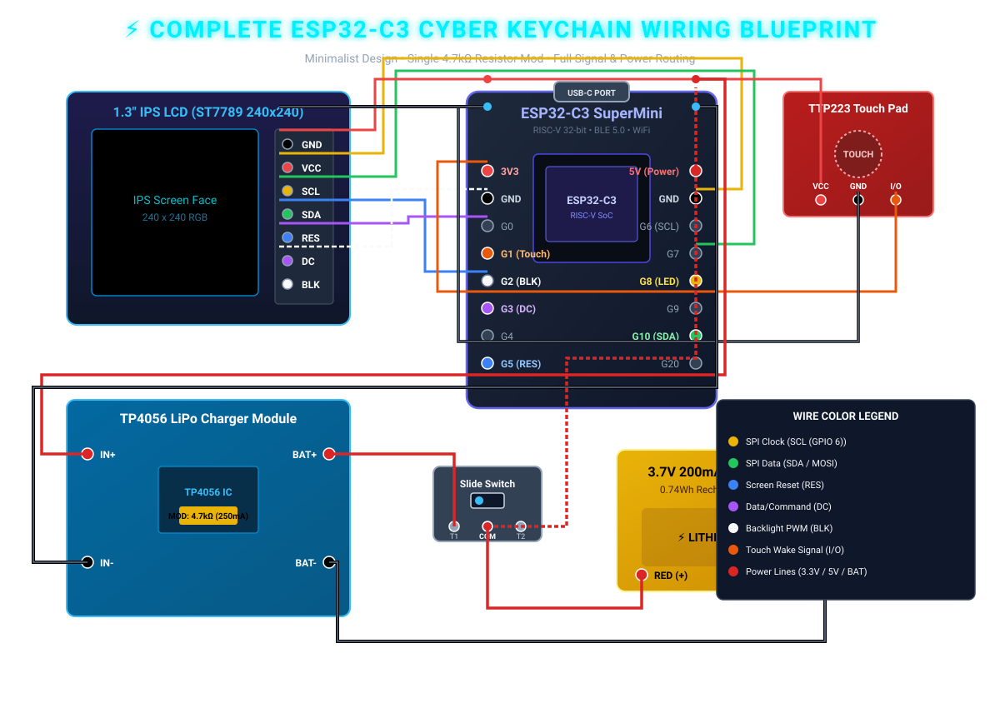
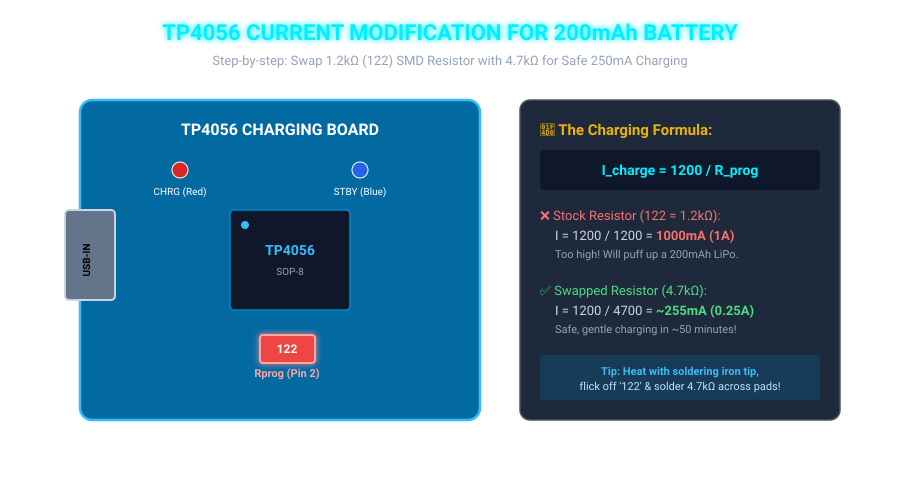
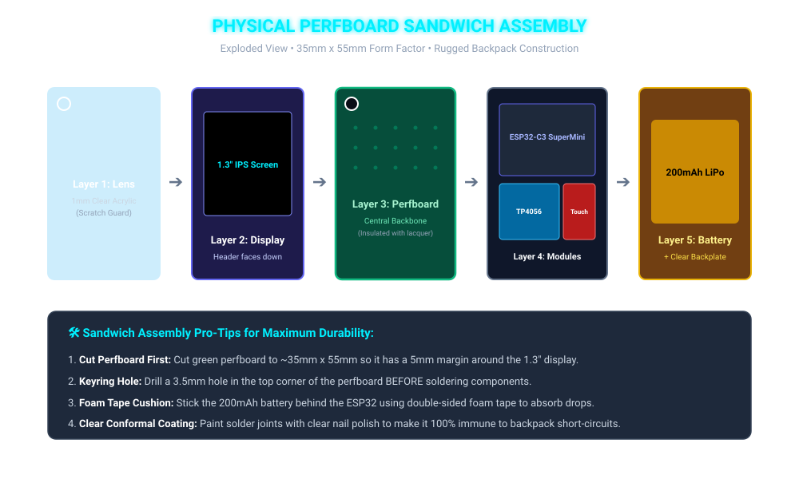

---
marp: true
theme: gaia
_class: lead
paginate: true
backgroundColor: #0b0f19
color: #c9d1d9
style: |
  section {
    font-family: 'Segoe UI', Roboto, sans-serif;
    font-size: 19px;
    padding: 30px 35px;
  }
  h1 {
    color: #00f0ff;
    text-shadow: 0 0 10px rgba(0, 240, 255, 0.4);
    font-size: 28px;
  }
  h2 {
    color: #ffe600;
    font-size: 23px;
    margin-bottom: 10px;
  }
  h3 {
    color: #00ff66;
    font-size: 19px;
  }
  code {
    background: #161b22;
    color: #00f0ff;
    font-size: 15px;
  }
  pre {
    background: #161b22;
    border: 1px solid #30363d;
    padding: 8px;
    font-size: 14px;
    border-radius: 6px;
  }
  table {
    font-size: 14px;
  }
  .highlight {
    color: #ff007f;
    font-weight: bold;
  }
  footer {
    color: #8b949e;
    font-size: 12px;
  }
---

# ⚡ ESP32-C3 Cyber Keychain
## Master Circuit & Hardware Wiring Manual
### Visual Diagrams • Zero-Clutter Routing • Step-by-Step Soldering

---

# 🗺️ Complete Visual Circuit Blueprint

---

# 📋 Pin-by-Pin Master Connection Chart

| Module & Pin | Connects to ESP32 Pin | Wire Color | Electrical Function & Signal |
| :--- | :--- | :---: | :--- |
| **Display GND** | ESP32 `GND` | ⚫ Black | Screen Power Ground |
| **Display VCC** | ESP32 `3.3V` | 🔴 Red | 3.3V Regulated Power Rail |
| **Display SCL** | ESP32 `GPIO 8` | 🟡 Yellow | Hardware SPI Clock (SCK @ 40MHz) |
| **Display SDA** | ESP32 `GPIO 10` | 🟢 Green | Hardware SPI Data (MOSI) |
| **Display RES** | ESP32 `GPIO 5` | 🔵 Blue | Screen Hardware Reset Signal |
| **Display DC** | ESP32 `GPIO 3` | 🟣 Purple | Data (High) / Command (Low) Select |
| **Display BLK** | ESP32 `GPIO 2` | ⚪ White | Backlight PWM Dimming (0–255) |
| **Touch VCC** | ESP32 `3.3V` | 🔴 Red | Touch Sensor 3.3V Power |
| **Touch GND** | ESP32 `GND` | ⚫ Black | Touch Sensor Ground |
| **Touch I/O** | ESP32 `GPIO 1` | 🟠 Orange | Deep Sleep RTC Wakeup Interrupt |

---

# 🔧 The TP4056 Resistor Mod (Illustrated)

---

# 🔋 Power, Charging & Switch Flow Explained

### How the Single USB-C Port Powers & Charges Everything:

1. **When USB-C is Plugged In**:
   - The ESP32-C3 SuperMini's USB-C port receives **$5\text{V}$**.
   - Power leaves the ESP32's `5V` pin and enters the TP4056's **`IN+`** pad.
   - The TP4056 steps down and regulates charging at **$255\text{mA}$** safely into the 200mAh LiPo through `BAT+` and `BAT-`.

2. **When Running on Battery (Unplugged)**:
   - Battery outputs **$3.7\text{V}$ to $4.2\text{V}$**.
   - Current passes through the **SPDT Slide Switch** into the ESP32's **`5V` pin**.
   - The ESP32-C3 SuperMini's onboard **3.3V LDO regulator** steps it down to a stable, clean **$3.3\text{V}$** to feed the chip, the 1.3" display, and the touch sensor!

---

# 🥪 Physical Perfboard Sandwich Assembly

---

# 🛠️ Step-by-Step Soldering Sequence (1 to 10)

Follow this order to prevent damaging heat-sensitive parts:

1. **Step 1 (Cut & Drill)**: Cut perfboard to $\approx 35\text{mm} \times 55\text{mm}$. Drill a $3.5\text{mm}$ keyring hole in the top corner.
2. **Step 2 (TP4056 Mod)**: Desolder SMD resistor `122` ($1.2\text{k}\Omega$) on the TP4056 and solder your **$4.7\text{k}\Omega$ resistor** across the pads.
3. **Step 3 (Mount Display)**: Solder the 7-pin header of the 1.3" IPS LCD on the front face of the perfboard.
4. **Step 4 (Mount ESP32)**: Solder the ESP32-C3 SuperMini on the back face of the perfboard.
5. **Step 5 (Wire SPI Data Lines)**: Solder Yellow (GPIO8), Green (GPIO10), Blue (GPIO5), Purple (GPIO3), and White (GPIO2) from display to ESP32.
6. **Step 6 (Wire 3.3V & GND Rails)**: Connect `3.3V` and `GND` to Display and TTP223 Touch sensor.
7. **Step 7 (Mount Switch)**: Solder the 4mm SPDT Slide Switch onto the side edge of the perfboard.
8. **Step 8 (Wire TP4056 Charger)**: Wire ESP32 `5V` $\rightarrow$ `IN+`, ESP32 `GND` $\rightarrow$ `IN-`.
9. **Step 9 (Connect Battery)**: Solder Battery Black `(-)` to `BAT-`, and Battery Red `(+)` through the switch to ESP32 `5V`.
10. **Step 10 (Insulate)**: Paint all solder joints on the back with clear nail polish to prevent short-circuits.

---

# 🧪 Pre-Power Safety Verification Checklist

Before sliding the switch to "ON", check these with a Multimeter (Continuity Mode):

* [ ] **Ground Continuity Test**: Probe ESP32 `GND`, Display `GND`, TP4056 `IN-`, and Battery `(-)` — all must beep together (shared ground).
* [ ] **No 3.3V to GND Short**: Probe `3.3V` and `GND` — must **NOT** beep (infinite or high resistance).
* [ ] **No 5V to GND Short**: Probe `5V` and `GND` — must **NOT** beep.
* [ ] **Resistor Mod Verified**: Measure resistance across TP4056 Pin 2 and GND — should read $\approx 4.7\text{k}\Omega$.
* [ ] **Polarity Check**: Ensure Red wire from LiPo goes to `BAT+` / Switch, and Black wire goes to `BAT-` / `GND`.

---

# 🔍 Troubleshooting Matrix

| Symptom | Probable Cause | Exact Fix |
| :--- | :--- | :--- |
| **Screen is completely black** | Backlight `BLK` pin is floating | Ensure `BLK` wire is soldered securely to `GPIO 2`. |
| **Screen has power but no image** | SPI Clock or Data pins swapped | Swap `SCL` (must be GPIO8) and `SDA` (must be GPIO10). |
| **Touch sensor doesn't wake device** | Wrong GPIO or mode | Ensure touch `I/O` wire is on `GPIO 1` (RTC GPIO domain). |
| **ESP32 reboots continuously** | Battery voltage is $<3.0\text{V}$ | Plug in USB-C cable for 30 minutes to charge the battery. |
| **Battery gets hot while charging** | Stock 1A resistor still installed | Verify resistor `122` was replaced with $4.7\text{k}\Omega$. |

---

# 🚀 Your Wiring is 100% Complete!

* 📕 **Printable Circuit PDF**: `wiring_guide.pdf`
* 🖥️ **Interactive Circuit Slides**: `wiring_guide.html`
* 🗺️ **High-Res Vector Diagrams**: Inside `assets/` directory

**⚡ Happy Building & Soldering! ⚡**
